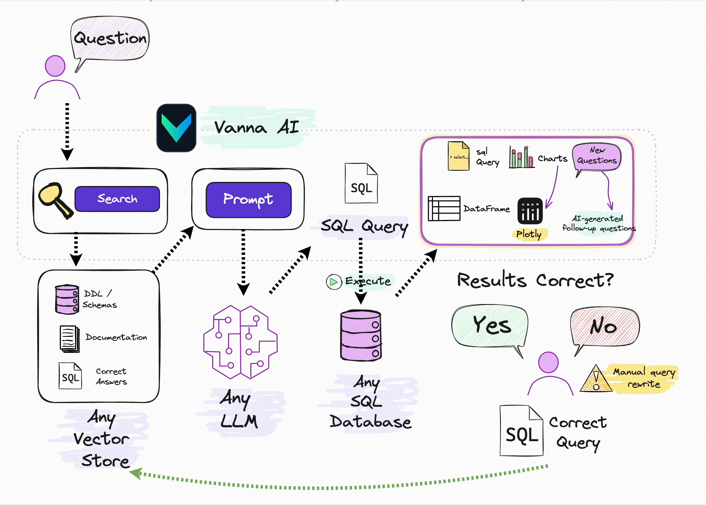

## 1. How Vanna works



## 2. This Works

step1. install python requirements.txt

step2. config your env in Local_Vanna.py (llm, embedding, mysql)

step3. run streamlit

```
streamlit run Chat_Page.py
```

step4. training

> In RAG_Page.by, only SQL queries can be added to training data, and others are not currently supported.


## 3. Refrences

[vanna-ai/vanna: 🤖 Chat with your SQL database 📊. Accurate Text-to-SQL Generation via LLMs using RAG 🔄. (github.com)](https://github.com/vanna-ai/vanna)

[vanna-ai/vanna-streamlit: Vanna AI Streamlit App (github.com)](https://github.com/vanna-ai/vanna-streamlit)
